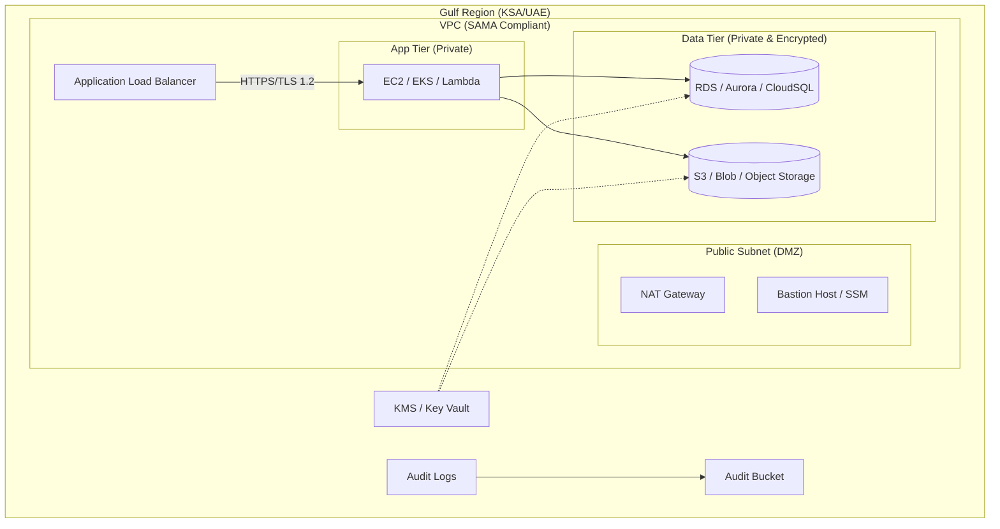

# terraform-aws-sama: The SAMA/NESA Compliance Kit for Gulf Tech (Multi-Cloud)

[](https://github.com/example/sama-compliance-kit/actions)

**Don't get fined. Deploy audit-ready infrastructure in KSA/UAE in 10 minutes.**

`terraform-aws-sama` is an opinionated, battle-tested Terraform library designed specifically for Fintechs, Healthcare, and Government entities in Saudi Arabia (SAMA) and the UAE (NESA/DESC). It implements strict data residency, encryption, and audit logging requirements out of the box.

**Now supporting Multi-Cloud: AWS, GCP, Azure, and OCI.**

## 🏗 Architecture

This kit deploys a **3-Tier Private Architecture** compliant with SAMA Cyber Security Framework across supported clouds.



## 📂 Directory Structure

```plaintext
sama-compliance-kit/
├── .github/workflows/   # CI/CD pipelines (Terraform validate, tflint, tfsec)
├── aws/                 # AWS Terraform modules (S3, VPC, KMS, EKS)
├── azure/               # Azure Terraform modules (Storage, VNet, KeyVault)
├── gcp/                 # GCP Terraform modules (Cloud Storage, VPC, KMS)
├── oci/                 # OCI Terraform modules (Object Storage, VCN, Vault)
├── tests/               # Integration tests
├── docker-compose.yml   # Local testing infrastructure (LocalStack, Azurite, FakeGCS)
└── README.md            # Project documentation
```

## 🛡 Compliance Mapping (SAMA/NESA)

We map SAMA Cyber Security Framework controls directly to Terraform resources.

| Control ID | Description | Terraform Implementation | Module |
|------------|-------------|--------------------------|--------|
| **3.3.9.4** | Cryptographic Key Management | KMS (AES-256) with automatic rotation. | `module.security` |
| **3.3.8.5** | Network Segmentation | VPC with strict Public/Private subnets. | `module.network` |
| **3.1.1.6** | Independent Audit Logs | Audit logs enabled globally. | `module.security` |
| **3.3.15.4** | Incident Management Logs | Centralized logging bucket with MFA delete. | `module.data` |

## 🏗 State Management & Layered Architecture

To ensure **safety** and **isolation**, we recommend a layered approach to Terraform state. This prevents accidental destruction of critical data when modifying ephemeral compute resources.

### Recommended Structure

1.  **01-network**: VPC, Subnets, Security Groups, NACLs. (Changes rarely)
2.  **02-data**: Databases, S3 Buckets, KMS Keys. (Stateful, Critical, Delete Protection)
3.  **03-compute**: EC2, EKS, Lambda. (Stateless, Ephemeral)

### Why?

-   **Safety**: You can lock down the `02-data` state file with stricter permissions.
-   **Speed**: `03-compute` plans are faster without refreshing the entire network/data estate.
-   **Recovery**: Easier to recreate compute layers without touching persistent data.

See `examples/aws/` for a reference implementation.

## 🚀 Usage Guide

### AWS
Located in `aws/`.
The original robust AWS compliance module.
See `aws/README.md` (if available) or `aws/main.tf` for usage.

### Google Cloud Platform (GCP)
Located in `gcp/`.

- **Region**: `me-central2` (Dammam) - Critical for KSA data residency.
- **Features**: Cloud SQL (Private IP, CMEK), Storage Bucket (Uniform Access), VPC Service Controls.

```hcl
module "gcp_compliance" {
  source = "./sama-compliance-kit/gcp"
  project_id = "my-gcp-project"
  region     = "me-central2"
  # ...
}
```

### Microsoft Azure
Located in `azure/`.

- **Region**: `uae-north` or `qatar-central` (or Saudi regions).
- **Features**: PostgreSQL Flexible Server (Infrastructure Encryption), Storage Account (Private Endpoint).

```hcl
module "azure_compliance" {
  source = "./sama-compliance-kit/azure"
  resource_group_name = "sama-rg"
  # ...
}
```

### Oracle Cloud Infrastructure (OCI)
Located in `oci/`.

- **Region**: `me-jeddah-1` or `me-riyadh-1`.
- **Features**: VCN, Object Storage (Private).

```hcl
module "oci_compliance" {
  source = "./sama-compliance-kit/oci"
  compartment_id = "ocid1.compartment..."
  # ...
}
```

## 🧪 Testing Infrastructure

We provide local testing setups to validate compliance before deployment.

- **Azure**: Uses `Azurite` (Docker) to mock Blob Storage. Run via `docker-compose` in `tests/azure/`.
- **GCP**: Uses `fake-gcs-server` (Docker) to mock Cloud Storage. Run via `docker-compose` in `tests/gcp/`.
- **OCI**: Relies on static analysis (`terraform validate`, `checkov`). See `tests/oci/README.md`.
- **AWS**: Standard `localstack` support (see AWS module docs).

## 🤝 Contributing
See [CONTRIBUTING.md](CONTRIBUTING.md) for details on how to add more controls.

## 📄 License
MIT License. See [LICENSE](LICENSE).
